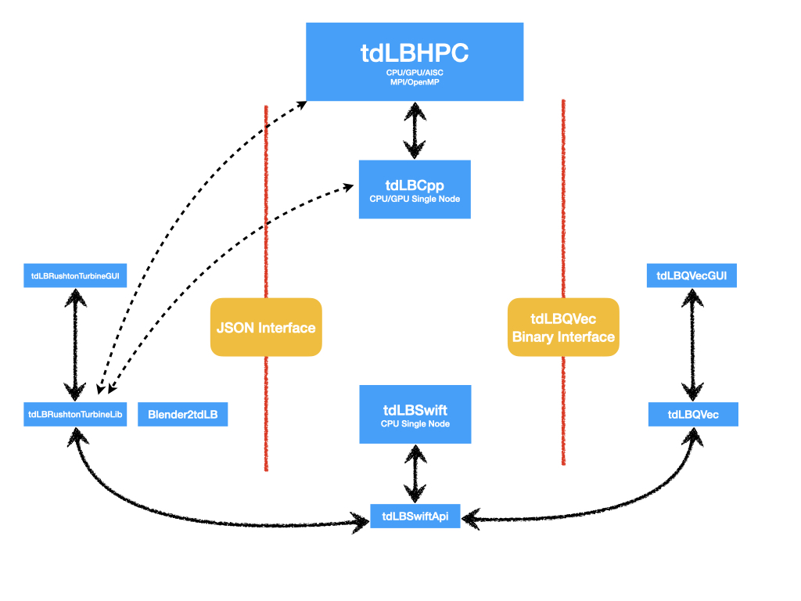
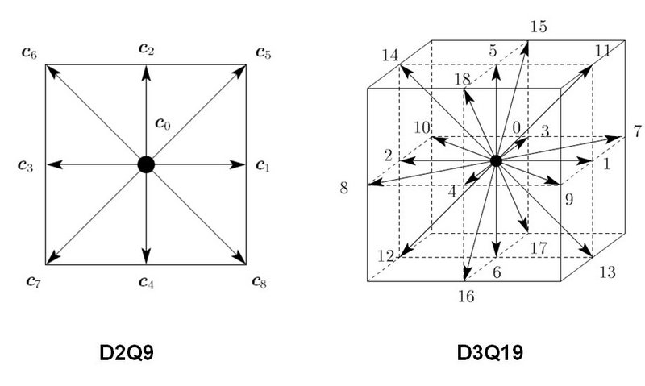

# Turbulent Dynamics Lattice Boltzmann (C++)

This is a basic version of the multi-node heterogeneous HPC code to run simulation with hundreds of billions of cells.

## Quick Start

### Setup Development Environment
```bash
# Clone with submodules
git clone --recursive https://github.com/TurbulentDynamics/tdLBCpp
cd tdLBCpp

# Run setup script to check dependencies
./setup-dev.sh
```

## Building

### Simple Build (Using Makefile)

```bash
# CPU build (default)
make cpu

# GPU build
make gpu

# GPU build with specific architecture
make gpu CUDA_ARCH=sm_75 CUDA_PATH=/usr/local/cuda-11.5

# MPI + GPU build
make mpi-gpu

# Debug build
make debug

# Build and test
make all-cpu

# Show all available targets
make help
```

### Alternative: Using Helper Scripts

```bash
# CPU build (default)
./build.sh --config cpu --type release

# GPU build
./build.sh --config gpu --type release

# GPU build with specific architecture
./build.sh --config gpu --arch sm_75 --cuda-path /usr/local/cuda-11.5

# MPI + GPU build
./build.sh --config mpi_gpu --type release

# Debug build
./build.sh --config gpu --type debug

# Build and test
./build.sh --config cpu --test

# For more options
./build.sh --help
```

### Advanced Build (Direct Bazel)

**Generic CPU build:**
```bash
bazel build //tdlbcpp/src:tdlbcpp --verbose_failures -s
```

**GPU build:**
```bash
bazel build --config gpu //tdlbcpp/src:tdlbcpp
bazel build --config gpu_shared //tdlbcpp/src:tdlbcpp
```

**Debug build:**
```bash
bazel build -c dbg --config gpu //tdlbcpp/src:tdlbcpp
```

**GPU with custom CUDA settings:**
```bash
bazel build --config gpu \
  --@rules_cuda//cuda:cuda_targets=sm_75 \
  --repo_env=CUDA_PATH=/usr/local/cuda-11.5 \
  //tdlbcpp/src:tdlbcpp
```

### Dependencies

**Required:**
- Bazel (5.0+)
- Python 3
- C++ compiler (g++ 7.4+ or clang++ with C++17)
- Git

**Optional:**
- CUDA Toolkit (11.0+) for GPU builds
- MPI (OpenMPI/MPICH) for distributed builds

**Installation:**
```bash
# macOS
brew install bazel python3

# Ubuntu/Debian
sudo apt install bazel python3 g++ git

# For GPU support
sudo apt install nvidia-cuda-toolkit
cp /location/to/cuda-samples/Common/{helper_*,exception.h} tdlbcpp/src

# For MPI support
sudo apt install libopenmpi-dev openmpi-bin
```

See [BUILD_GUIDE.md](BUILD_GUIDE.md) for detailed build instructions.

## Running

### Using Makefile

```bash
# Generate input file
make generate-input GRID_SIZE=100

# Run simulation
make run INPUT_FILE=input_grid100.json

# Generate and run in one step
make run-generated GRID_SIZE=100

# Run with existing test input
make run-test
```

### Using Symlink (After Building)

After building with `make cpu` or `make gpu`, a symlink `tdlbcpp-bin` is created in the project root:

```bash
# Build first
make cpu

# Run directly using the symlink
./tdlbcpp-bin --input_file input.json

# Or load from checkpoint
./tdlbcpp-bin --checkpoint_dir checkpoint_2021_9_21__jd7aflakjd
```

### Manual Method

```bash
# Generate input file
python3 generate_stirred_tank_input.py -x 100 -f input_debug_gridx100_numSteps20.json

# Run simulation
bazel-bin/tdlbcpp/src/tdlbcpp --input_file input_debug_gridx100_numSteps20.json

# Load from checkpoint
bazel-bin/tdlbcpp/src/tdlbcpp --checkpoint_dir checkpoint_2021_9_21__jd7aflakjd
```

## Testing

### Using Makefile

```bash
# Run all tests
make test

# Run tests with verbose output
make test-verbose

# Run specific test
make test-params

# Run tests with coverage
make test-coverage
```

### Alternative Methods

```bash
# Using helper script
./test.sh
./test.sh --verbose
./test.sh //tdlbcpp/tests/Params:tests

# Direct Bazel command
bazel test //tdlbcpp/tests/...
bazel test //tdlbcpp/tests/Params:tests
```

## Build Configurations

tdLBCpp supports multiple build configurations:

| Config | Description | Use Case |
|--------|-------------|----------|
| `cpu` | CPU-only build | Default, no special hardware |
| `gpu` | GPU-accelerated (CUDA) | Single GPU workstation |
| `gpu_shared` | GPU with shared memory | GPU with shared memory support |
| `mpi` | MPI distributed computing | Multi-node clusters |
| `mpi_gpu` | MPI + GPU | GPU clusters |
| `tegra` | NVIDIA Tegra platforms | Embedded GPU systems |

See [BUILD_GUIDE.md](BUILD_GUIDE.md) for complete documentation.

## Package Structure


## Vector Identification (see [Header.h](tdlbcpp/src/Header.h))


## Documentation

- [QUICK_REFERENCE.md](QUICK_REFERENCE.md) - Quick reference for common commands
- [BUILD_GUIDE.md](BUILD_GUIDE.md) - Comprehensive build and development guide
- [docs/](docs/) - Additional documentation and diagrams
- [BZLMOD_MIGRATION.md](BZLMOD_MIGRATION.md) - Bzlmod migration details (Bazel 8+)

## Contributing

When contributing, please:
1. Run tests before submitting: `./test.sh`
2. Use appropriate build configurations
3. Follow existing code style
4. Update documentation as needed
